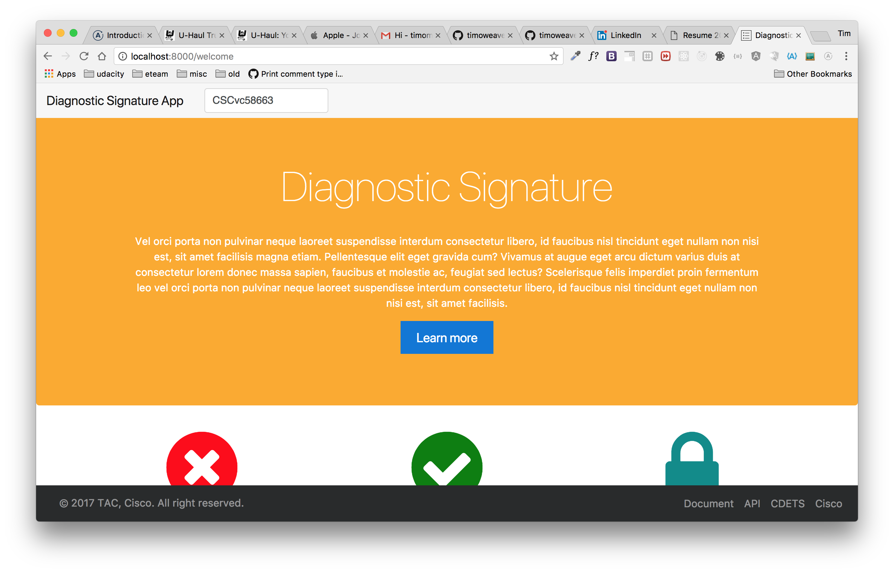
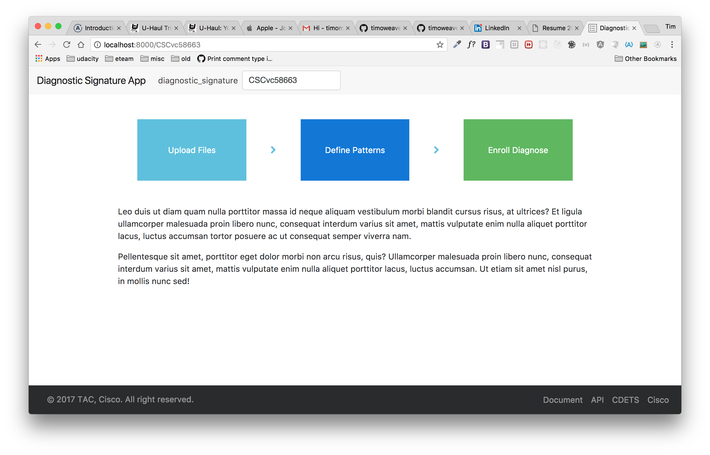
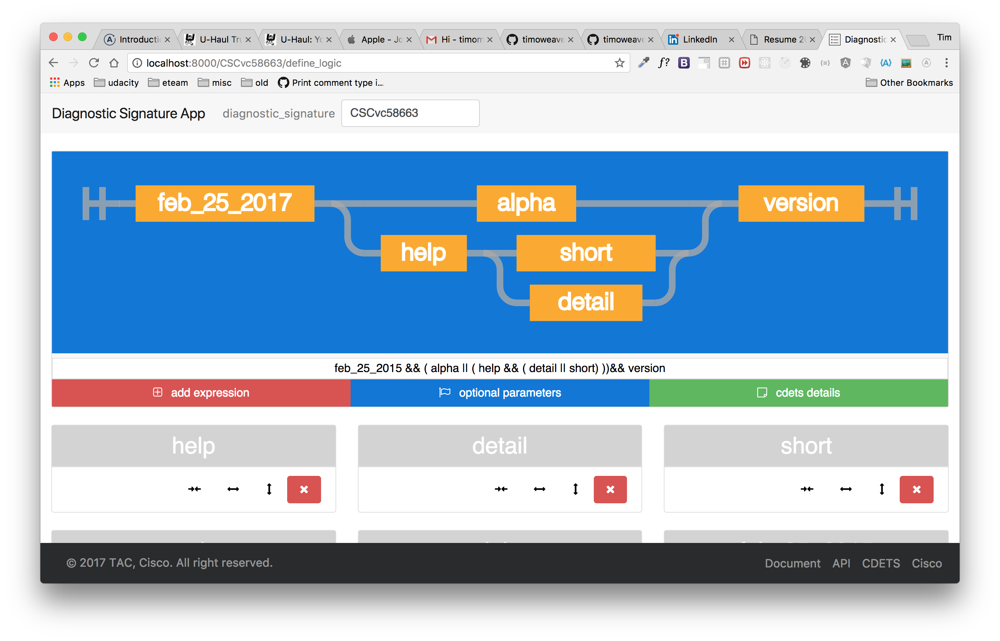
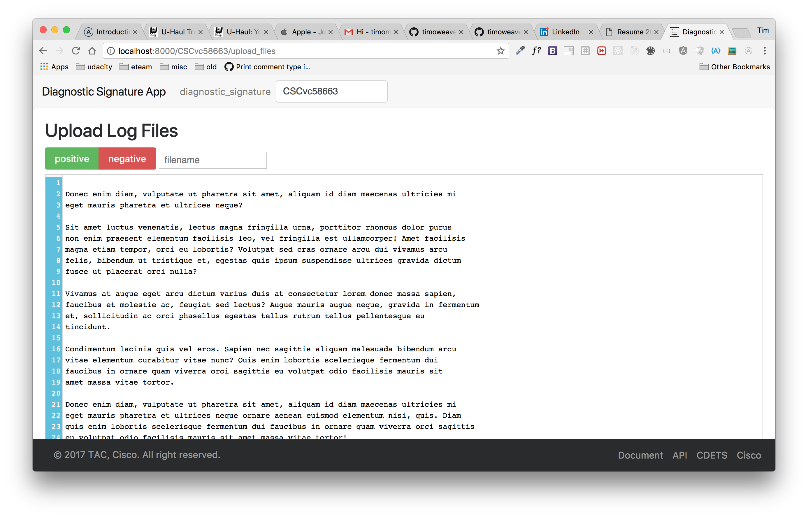

# Grep Text File Logs App

1. codemirror textarea
   1.1. accordion
1. bowersify node modules
1. mongoose restful api
1. swagger api integration
1. upload/database
1. passport oauth2

# Screen Captures
## Welcome page

## Work flow

## Regexp Equations

## Upload Files

